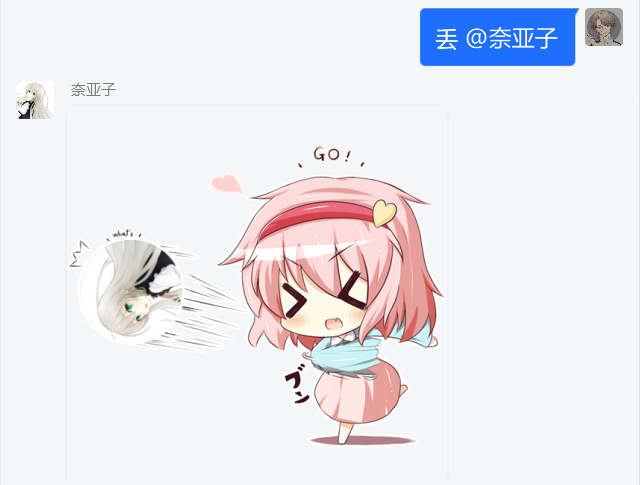

# mirai-console-throw-it

Fork自 [ThrowIt-Mirai](https://github.com/MoeMegu/ThrowIt-Mirai)

重构为Kotlin

“丢人” 插件，用指令把你@的人丢出去

## Usage

将插件置于plugin目录下, 并安装chat-command插件

使用插件需要权限 com.github.samarium150.mirai-console-throw-it:command.throw

使用以下指令来给所有群成员权限

`> /perm permit m* com.github.samarium150.mirai-console-throw-it:command.throw`

聊天环境使用命令:

`(/)丢 <@目标>` 或 `(/)throw <@目标>`

也可以直接指定qq号或者在群里用`$`指代随机目标

使用 `(/)th-clean` 或 `(/)清理` 来清理缓存

每日00：00也会定时清理

## Reference

[ThrowIt-Mirai](https://github.com/MoeMegu/ThrowIt-Mirai)

[ThrowItBot](https://github.com/YJBeetle/ThrowItBot)

[Original Picture](https://www.pixiv.net/artworks/28356129)
